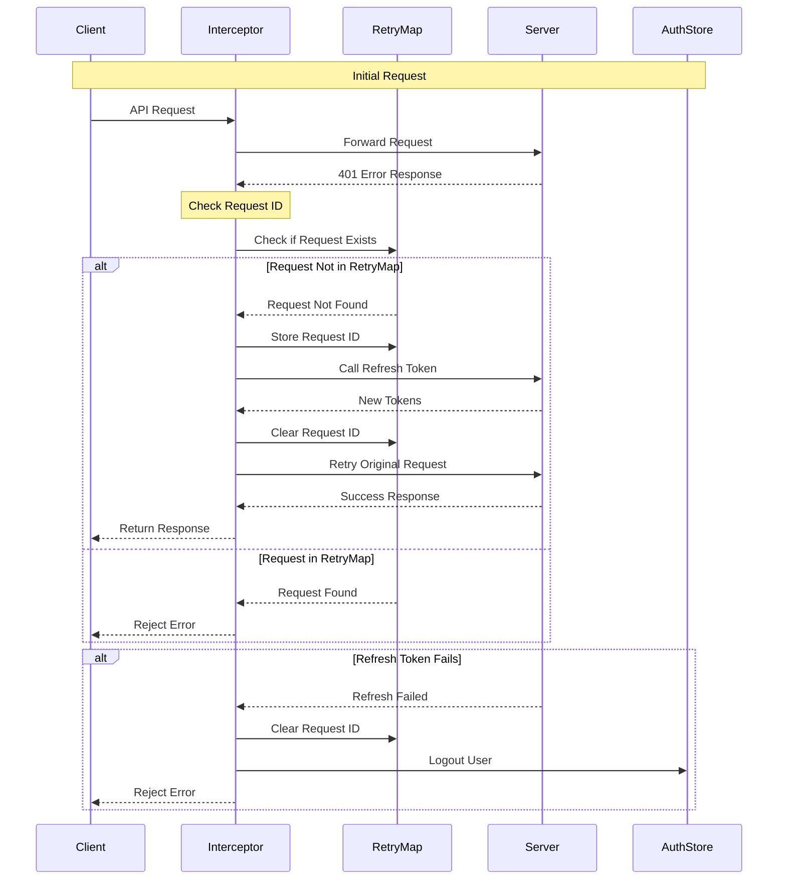

# API Interceptor Sequence Diagram

## Sequence Flow Explanation

1. **Initial Request**
   - Client makes API request
   - Interceptor forwards to server
   - Server returns 401 error

2. **Retry Check**
   - Interceptor checks RetryMap
   - If request exists → reject error
   - If request doesn't exist → proceed with refresh

3. **Token Refresh**
   - Store request in RetryMap
   - Call refresh token endpoint
   - Get new tokens from server

4. **Request Retry**
   - Clear request from RetryMap
   - Retry original request
   - Return response to client

5. **Error Handling**
   - If refresh fails:
     - Clear RetryMap
     - Logout user
     - Reject error

## Key Components

1. **Client**
   - Makes API requests
   - Receives responses/errors

2. **Interceptor**
   - Handles request/response flow
   - Manages token refresh
   - Controls retry logic

3. **RetryMap**
   - Tracks retried requests
   - Prevents duplicate retries

4. **Server**
   - Handles API requests
   - Manages authentication
   - Issues new tokens

5. **AuthStore**
   - Manages user state
   - Handles logout 