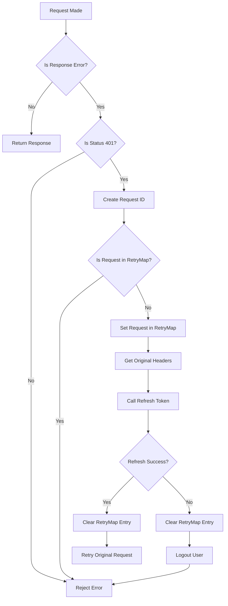

# API Interceptor Flowchart

## Flow Explanation

1. **Initial Request**
   - Any API request is made through the axios instance

2. **Error Check**
   - Check if the response is an error
   - If not, return the response normally

3. **401 Status Check**
   - If error, check if status is 401 (Unauthorized)
   - If not 401, reject the error normally

4. **Request Tracking**
   - Create unique request ID using method, URL, and data
   - Check if request is already in RetryMap

5. **Retry Prevention**
   - If request is in RetryMap, reject error
   - If not in RetryMap, proceed with refresh flow

6. **Token Refresh**
   - Store request in RetryMap
   - Save original headers
   - Call refresh token endpoint

7. **Refresh Result**
   - If refresh succeeds:
     - Clear request from RetryMap
     - Retry original request with new token
   - If refresh fails:
     - Clear request from RetryMap
     - Logout user
     - Reject error

## Key Points

- Each request gets a unique identifier
- Same request won't be retried multiple times
- RetryMap is cleared after each operation
- User is logged out if refresh token fails
- Original request headers are preserved 